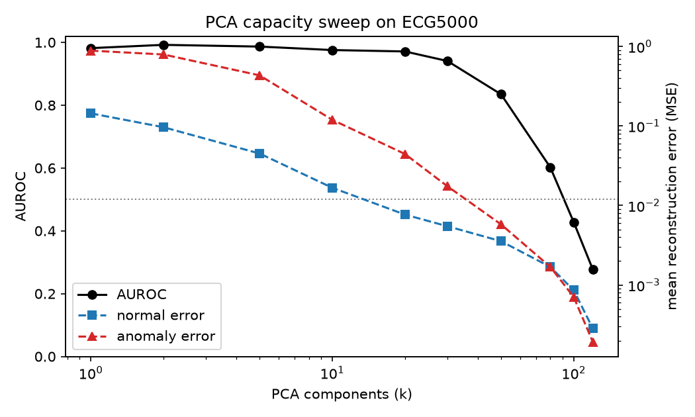

# Reconstruction-Anomaly Paradox

**Does a generative model that reconstructs data *too well* lose the ability to
tell normal data from anomalies?**

This project investigates a failure mode in reconstruction-based anomaly
detection: as a model's capacity (or input resolution) increases, it gets
better at reconstructing *everything* — including the anomalies it was
supposed to flag. The normal-vs-anomaly reconstruction-error gap shrinks,
and detection performance can collapse to chance.

## Motivation

While working on an anomaly detection pipeline for chromatography data
during an internship, I noticed that increasing the input resolution of a 1D
autoencoder made it reconstruct anomalous signals almost as well as normal
ones — degrading its ability to distinguish between them. This turns out to
connect to a documented phenomenon in the generative-modeling literature
(e.g. Nalisnick et al. on deep generative models assigning higher likelihood
to out-of-distribution data), and a related, noise-strength-dependent effect
in diffusion-based anomaly detection.

This project asks: **does the same paradox show up consistently across model
types** — specifically in a VAE and in a diffusion model — not just a plain
autoencoder?

## Approach

1. **Dataset:** [ECG5000](http://www.timeseriesclassification.com/description.php?Dataset=ECG5000)
   — 5,000 labeled heartbeats (140 time points each), class 1 = normal,
   classes 2–5 = different abnormal beat types. Chosen as a public,
   peak-structured 1D stand-in for the original chromatography signals.
2. **Train on normal data only**, as in real-world anomaly detection.
3. **Sweep a capacity knob** (number of PCA components / VAE latent
   dimension / diffusion noise strength) and measure, at each setting:
   - mean reconstruction error on held-out normal vs. anomalous beats
   - AUROC for normal-vs-anomaly separability using reconstruction error
     as the anomaly score
4. **Compare the resulting "paradox curve"** across model types.

## Status

- [x] Sanity check with PCA (a linear autoencoder) as a fast, dependency-light
      proxy — **confirms the paradox exists on this dataset** (see below).
- [ ] VAE implementation + capacity sweep
- [ ] Diffusion model implementation + noise-strength sweep
- [ ] Blog write-up

### Sanity check results (PCA)

| Components (k) | Normal error | Anomaly error | AUROC |
|---:|---:|---:|---:|
| 1   | 0.142  | 0.912  | 0.979 |
| 5   | 0.045  | 0.407  | 0.986 |
| 20  | 0.0075 | 0.047  | 0.978 |
| 50  | 0.0035 | 0.0062 | 0.873 |
| 80  | 0.0017 | 0.0015 | 0.519 |
| 120 | 0.0003 | 0.0002 | 0.324 |

AUROC starts near-perfect at low capacity and collapses to at/below chance
as capacity increases — the model becomes too good at reconstructing
anomalies to tell them apart from normal data.



## Repo structure

```
.
├── data/
│   ├── raw/              # ECG5000_TRAIN.txt, ECG5000_TEST.txt
│   └── processed/        # normal_signals.npy, anomaly_signals.npy
├── notebooks/
│   └── eda.ipynb
├── src/
│   ├── data.py
│   ├── pca_model.py
│   ├── vae.py             # in progress
│   ├── diffusion.py        # stretch goal
│   └── evaluate.py
├── experiments/
│   └── run_capacity_sweep.py
├── results/
│   ├── figures/
│   └── metrics/
└── blog/
    └── draft.md
```

## Setup

```bash
git clone https://github.com/Saniiyaa59/reconstruction-anomaly-paradox.git
cd reconstruction-anomaly-paradox
pip install -r requirements.txt
```

## Usage

```bash
# Download / prepare data
python src/data.py

# Run the PCA sanity-check sweep
python src/pca_model.py

# (coming soon) run the VAE capacity sweep
python experiments/run_capacity_sweep.py --model vae
```

## Background

Final project for CS599 "Deep Visual Generative Models" at Boston University.
Final deliverable is a blog post (draft in `blog/draft.md`) rather than an
academic paper, aimed at explaining this phenomenon accessibly.

## References

- Nalisnick, E. et al. "Do Deep Generative Models Know What They Don't Know?"
- Work on diffusion-based anomaly detection (e.g. DiffusionAD) noting
  detection sensitivity to noise-strength selection.

## License

MIT